# Detailed User Flows
## HE Inspection Application

**Version:** 2.0  
**Date:** 2026-07-20  
**Status:** Updated to Match Current Application

> Mermaid diagrams below reflect the current implemented `he-inspection` flow, route structure, and interaction model.

---

## 1. Login and Protected Access Flow

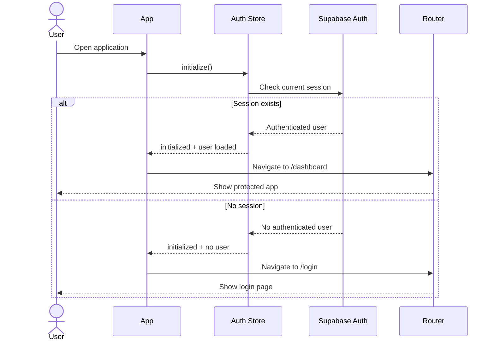

---

## 2. Equipment to New Inspection Flow

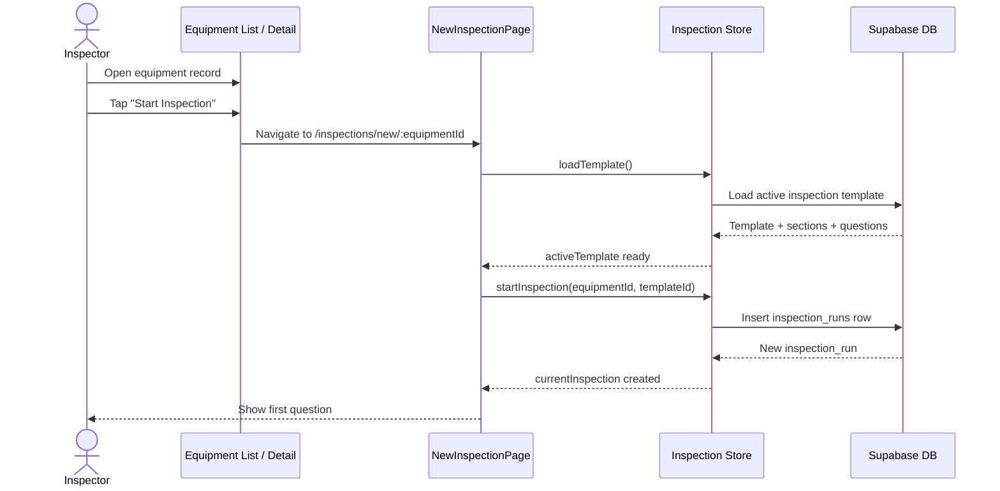

---

## 3. Inspection Question Flow — OK Path

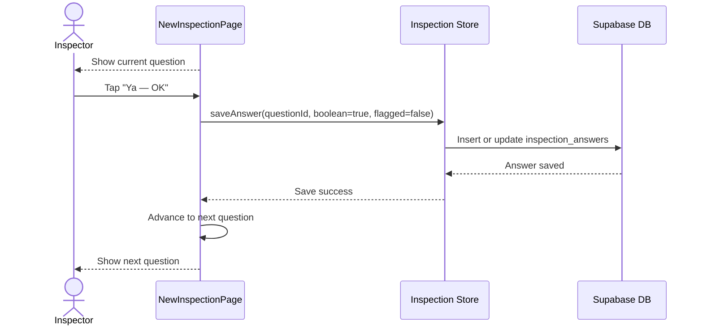

---

## 4. Inspection Question Flow — Finding Path

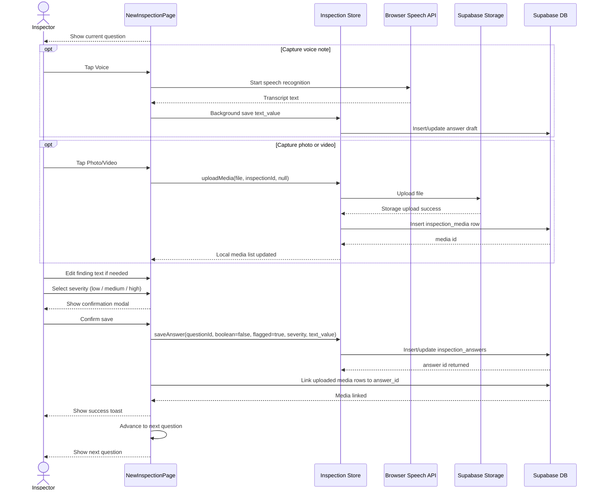

---

## 5. Inspection Pause Flow

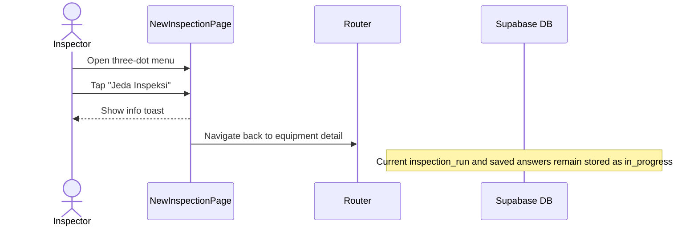

---

## 6. Inspection Completion Flow

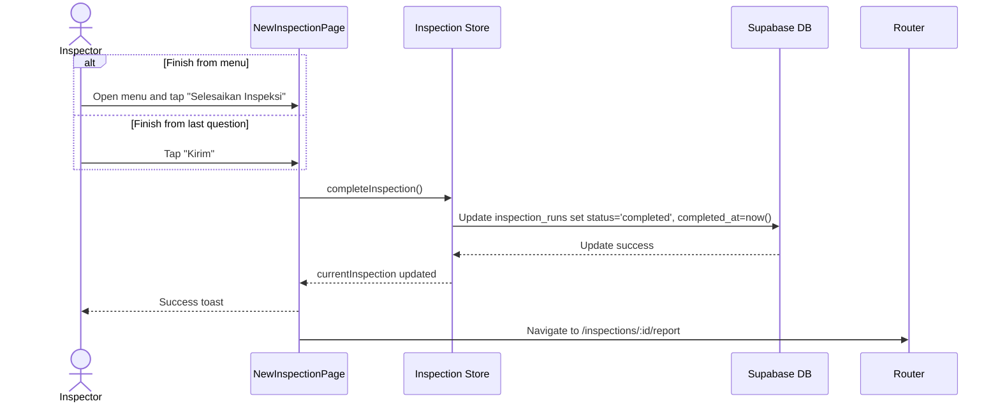

---

## 7. Inspection Review and Report Flow

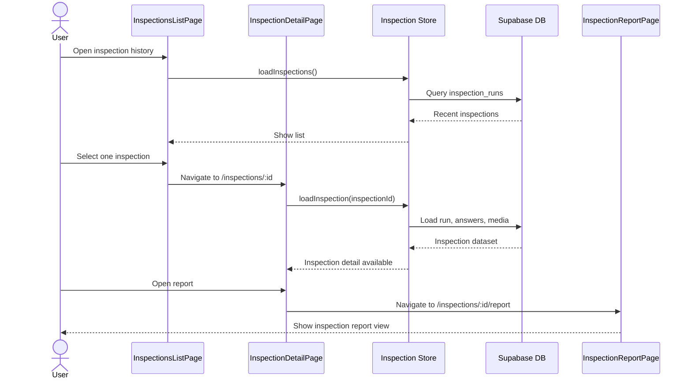

---

## 8. Defect Review and Update Flow

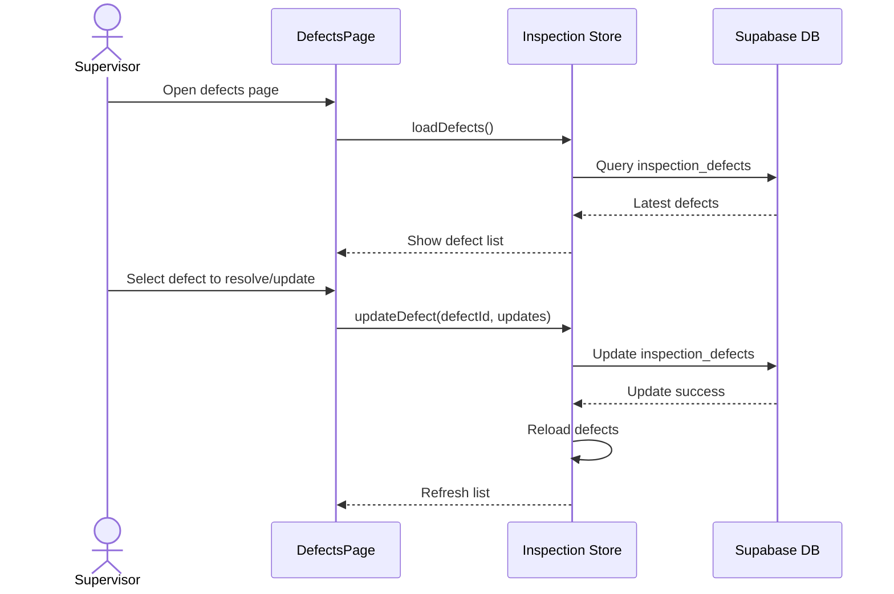

---

## 9. Template Loading and Editing Flow

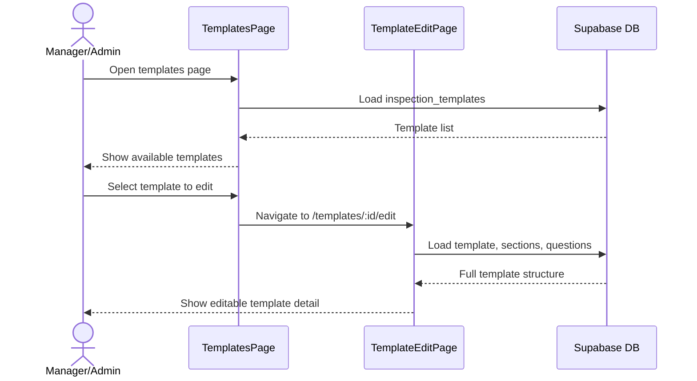

---

## 10. Equipment Management Flow

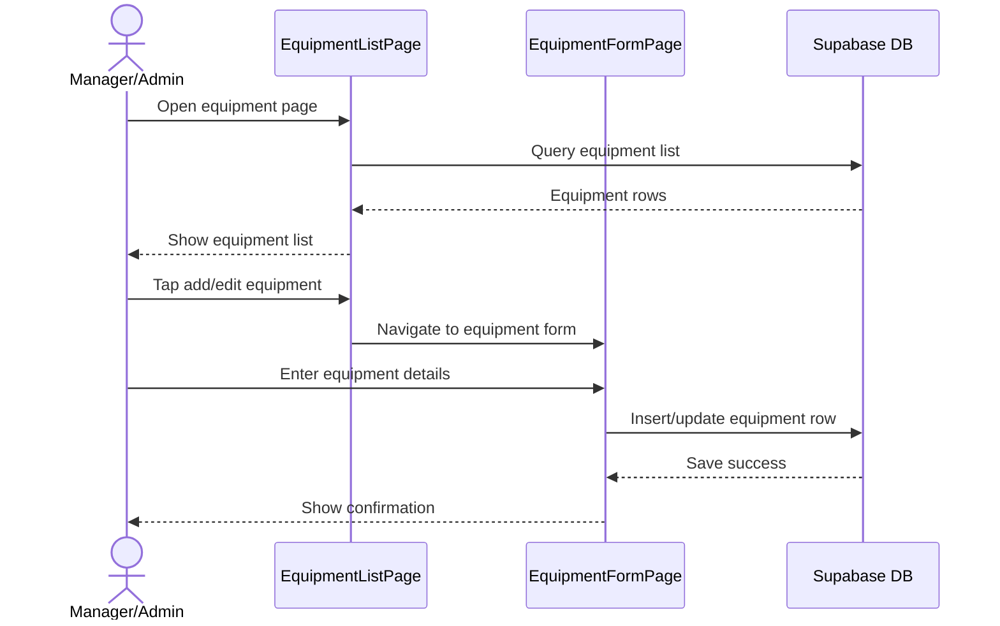

---

## 11. End-to-End Current Inspection Lifecycle

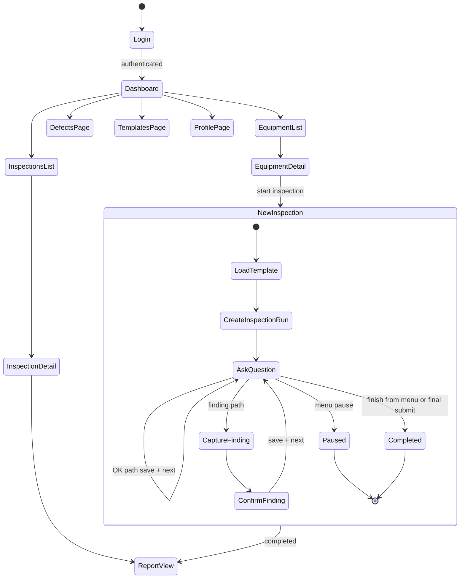

---

## 12. Current vs Future-State Note

These flows describe the **current implemented application**. They intentionally do not model the previously documented future-state items such as:

- full offline queue and sync engine
- QR-first inspection start
- automatic maintenance ticketing
- critical tag-out flow from the inspection page
- background template synchronization
- digital signature completion flow

Those items should only be documented again when they are actively implemented.